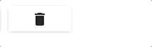

# Material UI Confirm Button



***

This is a component that allows inline confirmation of a button press. It is
highly customizable and allows most of the options of either FlatButton or
RaisedButton from [Material-UI](http://material-ui.com/).

## Installation

```sh
npm install --save material-ui-confirm-button
```

## Usage

The confirm button visible in the demo above was created as follows:

```js
import ConfirmButton from 'material-ui-confirm-button';
import Delete from 'material-ui/svg-icons/action/delete';

<ConfirmButton icon={<Delete />}
    confirmMessage="Delete"                      
    onSubmit={() => this.props.deleteModel()} />
```

Obviously, you can use this without the ES6 syntax and without material icons.

Note that all properties are forwarded to the button by default, so anything
that is useful on the material buttons can be used here as well.

The only properties that are intercepted are these:

| Property | Type | Description | Required |
| ----- | ---- | ---- | ---- |
| onSubmit | `function` | Callback for confirmed action | `true` |
| onOpen | `function` | Callback for initial button press | `false` |
| onCancel | `function` | Callback for canceling of action | `false` |
| isFlat | `bool` | Whether to use [FlatButton](http://www.material-ui.com/#/components/flat-button). Uses [RaisedButton](http://www.material-ui.com/#/components/raised-button) by default. | `false` |
| label | `string` | Message to display in initial button. | `false` |
| icon | `component` | Icon to display in initial button. This conflicts with `label` | `false` |
| cancelMessage | `string` | Message to display in cancel button. Defaults to "Cancel" | `false` |
| cancelIcon | `component` | Icon to display in cancel button. This conflicts with `cancelMessage` | `false` |
| confirmMessage | `string` | Message to display in confirm button. Defaults to "Confirm" | `false` |
| confirmIcon | `component` | Icon to display in confirm button. This conflicts with `confirmMessage` | `false` |
| isOpen | `bool` | Flag for controlling state. BEWARE: This will become a [Controlled Component](https://fb.me/react-controlled-components). | `false` |


## Small Print

### License

`Material UI Confirm Button` is released under the MIT license.

### Author

Mark Katerberg ([@diablomarcus](http://twitter.com/diablomarcus))

